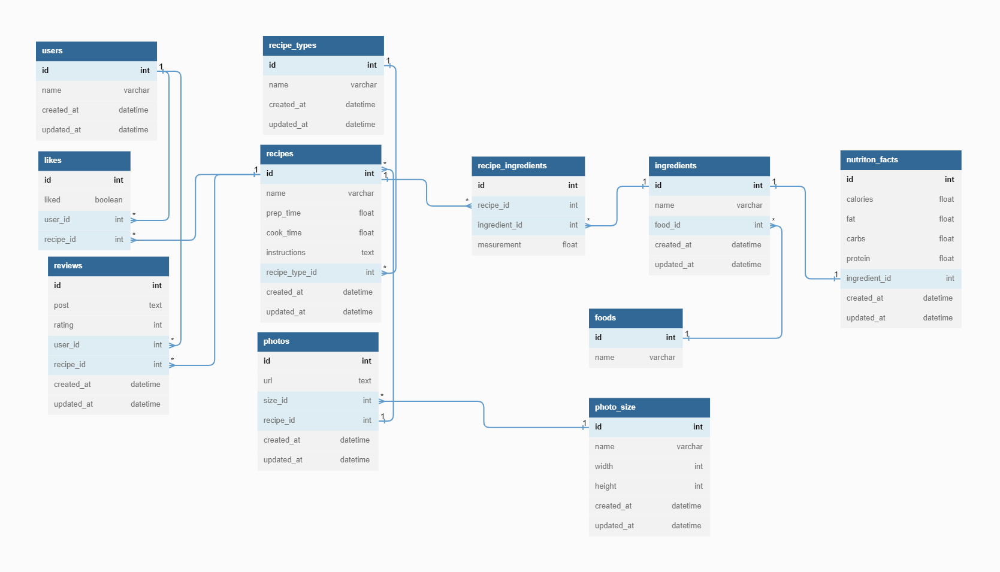

# Recipe API

## DataBase

[Database Docs](https://dbdocs.io/rajahwu/Recipe_API?table=photos&schema=public&view=table_structure)



## Sequelize Model Migrations

```bash
    ~ npx sequelize model:generate --name RecipeType --attributes name:string

    ~ npx sequelize model:generate --name Recipe --attributes name:string,prepTime:float,cookTime:float,instructions:text,recipeTypeId:integer

    ~ npx sequelize model:generate --name Food --attributes name:string

    ~ npx sequelize model:generate --name Ingredient --attributes name:string,foodId:integer

    ~ npx sequelize model:generate --name NutritonFact --attributes calories:float,fat:float,carbs:float,protein:carbs,ingredientId:integer

    ~ npx sequelize model:generate --name RecipeIngredient --attributes recipeId:integer,ingredientId:integer,mesurement:float

    ~ npx sequelize model:generate --name PhotoSize --attributes name:string,width:integer,height:integer

    ~ npx sequelize model:generate --name Photo --attributes url:text,sizeId:integer,recipeId:integer

    ~ npx sequelize model:generate --name User --attributes name:string

    ~ npx sequelize model:generate --name Review --attributes post:string,rating:integer,userId:integer,recipeId:integer

    ~ npx sequelize model:generate --name Like --attributes liked:boolean,userId:integer
```

## Sample recipe API endpoint

[Sample Source](https://developer.edamam.com/edamam-docs-recipe-api)

```json
{
  "from": 0,
  "to": 0,
  "count": 0,
  "_links": {
    "self": {
      "href": "string",
      "title": "string"
    },
    "next": {
      "href": "string",
      "title": "string"
    }
  },
  "hits": [
    {
      "recipe": {
        "uri": "string",
        "label": "string",
        "image": "string",
        "images": {
          "THUMBNAIL": {
            "url": "string",
            "width": 0,
            "height": 0
          },
          "SMALL": {
            "url": "string",
            "width": 0,
            "height": 0
          },
          "REGULAR": {
            "url": "string",
            "width": 0,
            "height": 0
          },
          "LARGE": {
            "url": "string",
            "width": 0,
            "height": 0
          }
        },
        "source": "string",
        "url": "string",
        "shareAs": "string",
        "yield": 0,
        "dietLabels": [
          "string"
        ],
        "healthLabels": [
          "string"
        ],
        "cautions": [
          "string"
        ],
        "ingredientLines": [
          "string"
        ],
        "ingredients": [
          {
            "text": "string",
            "quantity": 0,
            "measure": "string",
            "food": "string",
            "weight": 0,
            "foodId": "string"
          }
        ],
        "calories": 0,
        "glycemicIndex": 0,
        "totalCO2Emissions": 0,
        "co2EmissionsClass": "A+",
        "totalWeight": 0,
        "cuisineType": [
          "string"
        ],
        "mealType": [
          "string"
        ],
        "dishType": [
          "string"
        ],
        "instructions": [
          "string"
        ],
        "tags": [
          "string"
        ],
        "externalId": "string",
        "totalNutrients": {},
        "totalDaily": {},
        "digest": [
          {
            "label": "string",
            "tag": "string",
            "schemaOrgTag": "string",
            "total": 0,
            "hasRDI": true,
            "daily": 0,
            "unit": "string",
            "sub": {}
          }
        ]
      },
      "_links": {
        "self": {
          "href": "string",
          "title": "string"
        },
        "next": {
          "href": "string",
          "title": "string"
        }
      }
    }
  ]
}
```
